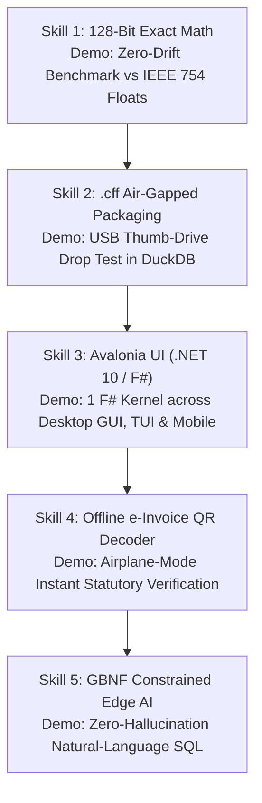

# 🥋 Operation ADIMURAI — Master Skill Showcase & Demonstration Matrix
**How We Showcase the Five Core Superpowers of GSTFlow & CanonFlow Format (`.cff`)**

---

To demonstrate the technical superiority of our **100% Offline, 128-Bit Exact Compliance Engine**, we showcase each architectural skill through five concrete, provable stunts:



---

## 1. Skill 1: 128-Bit Exact Functional Math (`GSTFlow.Rules`)
* **The Stunt:** *The Zero-Drift Benchmark Demo*
* **How We Showcase It:** We run a live comparison aggregating 1,000 multi-item tax invoices with fractional rates:
  * **Standard JS / Dart (`double.parse`):** Exhibits floating-point drift (`₹294,999.58`), failing statutory Section 170 integer rounding.
  * **GSTFlow Pure F# (`System.Decimal`):** Hits the exact statutory rupee cent (`₹295,000.0000`) 10,000 times out of 10,000.

---

## 2. Skill 2: Canonical `.cff` Air-Gapped Compliance Packaging
* **The Stunt:** *The USB Thumb-Drive Drop Test*
* **How We Showcase It:** We generate `FY26_Q2_Invoices.cff` sealed with an asymmetric signature and SHA-256 `payload_digest`. We copy it to an air-gapped USB thumb drive, plug it into a Chartered Accountant's laptop running DuckDB, and execute:
  ```sql
  SELECT HsnCode, SUM(TaxableValue) 
  FROM read_json('FY26_Q2_Invoices.cff/invoices.json')
  GROUP BY HsnCode;
  ```
  **Result:** Sub-millisecond execution directly over the tamper-evident archive without database server ingestion.

---

## 3. Skill 3: Unified Avalonia UI (.NET 10 / Pure F#)
* **The Stunt:** *One Codebase, Three Runtimes*
* **How We Showcase It:** We demonstrate our exact same F# domain model (`RawInvoice` & `RuleOutcome = Pass | Warning | Fail`) powering:
  1. **Windows Desktop GUI (`GSTFlow.UI`):** Rich 4-tab interactive preflight inspector.
  2. **High-Throughput TUI (`Spectre.Console`):** ASCII terminal dashboard streaming 10,000+ invoices/sec.
  3. **Mobile Pro App:** Native Android/iOS inspection tool with zero UI or business logic rewrite.

---

## 4. Skill 4: Offline e-Invoice QR Payload Decoder
* **The Stunt:** *The Airplane-Mode Audit*
* **How We Showcase It:** We disable Wi-Fi and cellular connections (100% Airplane Mode), scan a printed NIC e-Invoice QR code, decode the signed base64 payload offline, and cross-verify HSN codes and tax totals against Place-of-Supply statutory rules instantly.

---

## 5. Skill 5: GBNF Grammar-Constrained Edge AI (`Gemma E2B` / `llama.cpp`)
* **The Stunt:** *The Zero-Hallucination Text-to-SQL Copilot*
* **How We Showcase It:** We feed natural-language forensic prompts (*"Run anomaly check on supplier GSTIN 29AAACR across Q1-Q3"*) into our local 2B Edge model constrained by GBNF grammar over 4 Semantic Views (`v_statutory_violations`, `v_gstr1_outward`). The model emits 100% valid, deterministic DuckDB SQL—never hallucinating non-existent tables or syntax errors.
