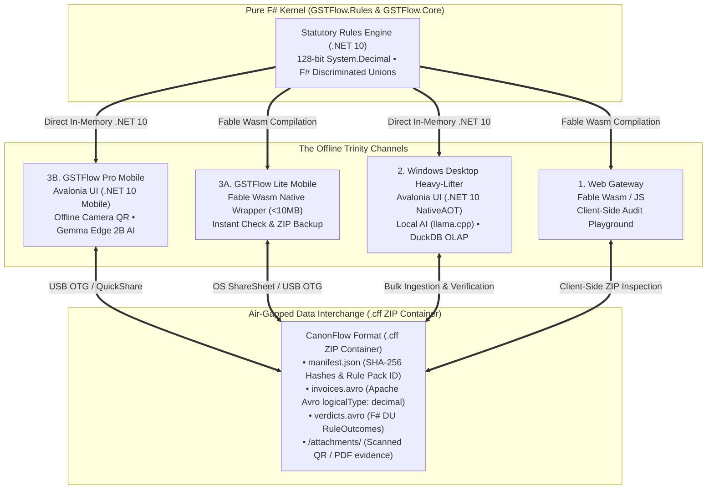
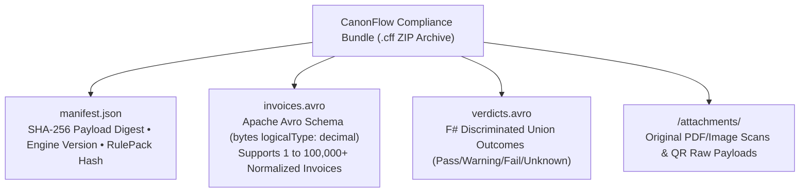
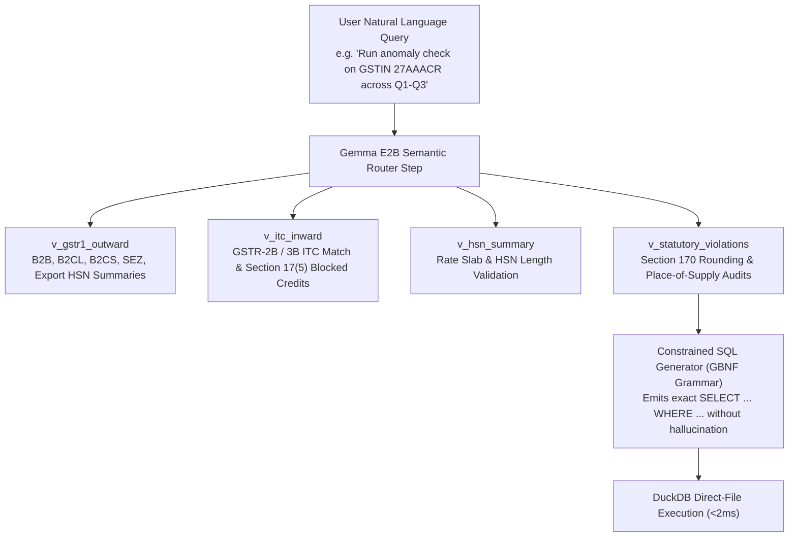

# GSTFlow: Maths Overhaul & Offline Trinity Architecture
**Definitive System Specification & Blindspot Mitigation Matrix**

---

## 1. Executive Summary & Blindspot Audit

By adopting **Avalonia UI (.NET 10 / F#)** on Desktop & Mobile Pro and **Fable Wasm/JS** on Web Gateway & Mobile Lite, we achieve 100% offline determinism. However, representing all statutory invoices via **Apache Avro (`.cff`) inside ZIP bundles** requires mitigating three critical engineering blindspots:

### 🚨 Blindspot 1: Apache Avro Decimal Precision (`logicalType: "decimal"`)
* **The Risk:** If an Avro schema defines tax values (`TaxableValue`, `Cgst`, `Sgst`, `Igst`) as `double` or `float`, binary floating-point drift will corrupt ₹1 statutory rounding.
* **The Mitigation:** Every monetary field in our Apache Avro schema **MUST** use Avro's `logicalType: "decimal"` backed by `bytes` with explicit `precision = 28` and `scale = 4` (e.g., supporting values up to `999,999,999,999,999,999,999,999.9999` INR exact).

```json
{
  "name": "TaxableValue",
  "type": {
    "type": "bytes",
    "logicalType": "decimal",
    "precision": 28,
    "scale": 4
  }
}
```

---

### 🚨 Blindspot 2: DuckDB Columnar Decimal Alignment
* **The Risk:** If DuckDB ingests Avro decimal fields into loose `DOUBLE` columns, analytical queries over 10,000 invoices will suffer rounding drift.
* **The Mitigation:** DuckDB schemas explicitly map Avro decimal columns to `DECIMAL(28,4)`. DuckDB performs 128-bit integer-scaled vectorized arithmetic over `DECIMAL(28,4)` columns, ensuring exact ₹0.0001 precision across millions of aggregated rows.

---

### 🚨 Blindspot 3: Fable Wasm/JS BigInt & Fixed-Point Scaling
* **The Risk:** JavaScript `Number` is an IEEE 754 64-bit float (safe integer limit $2^{53}-1$).
* **The Mitigation:** In Fable Wasm/JS (Web Gateway & Mobile Lite), monetary values are serialized and evaluated using scaled `BigInt` (or exact decimal polyfills) matching our `scale = 4` specification, preventing any float conversion.

---

## 2. End-to-End System Architecture (Mermaid)



---

## 3. `.cff` Apache Avro ZIP Container Anatomy

Every `.cff` file is a deterministic, tamper-evident ZIP archive structured to encapsulate any Indian GST invoice (B2B, B2C, SEZ, Credit Note, RCM) along with its statutory evidence:



### Why `.cff` ZIP + Apache Avro is Superior
1. **Multi-Invoice Bulk Capable:** A single `invoices.avro` block inside the ZIP can hold 1 invoice or 100,000 invoices efficiently compressed.
2. **Tamper-Evident:** `manifest.json` contains the SHA-256 digest of `invoices.avro` and `verdicts.avro`. Any single-byte tampering invalidates the verification seal.
3. **Audit Ready:** Chartered Accountants can import the `.cff` ZIP directly into DuckDB on Desktop with one command (`SELECT * FROM read_avro('invoices.avro')`).

---

## 4. Numeric & Type Fidelity Verification Matrix

| Layer | Runtime / Storage | Monetary Numeric Type | F# DU Representation | Float Drift Risk |
| :--- | :--- | :--- | :--- | :---: |
| **F# Kernel (`GSTFlow.Rules`)** | `.NET 10` NativeAOT | `System.Decimal` (128-bit exact) | F# Discriminated Union (`DU`) | **ZERO** |
| **Windows Desktop UI** | Avalonia UI (`.NET 10`) | `System.Decimal` (In-Memory) | Direct In-Memory F# DU | **ZERO** |
| **Mobile Pro UI** | Avalonia UI (`.NET 10 Mobile`) | `System.Decimal` (In-Memory) | Direct In-Memory F# DU | **ZERO** |
| **Apache Avro (`.cff`)** | Binary Serialization | `bytes` (`logicalType: decimal`, 28, 4) | Avro `union` & `enum` schemas | **ZERO** |
| **DuckDB Ledger** | Embedded OLAP | `DECIMAL(28,4)` | DuckDB `UNION` & `ENUM` columns | **ZERO** |
| **Web Gateway / Lite** | Fable Wasm / JS | Scaled `BigInt` / Fixed Exact | JS Tagged Union Objects | **ZERO** |

---

## 5. Direct-File Columnar Execution (`DuckDB on Parquet / Avro`) vs Mutable Tables

Why querying **DuckDB directly over immutable files (`Parquet` / `Apache Avro .cff`)** is vastly superior to traditional mutable database tables (`CREATE TABLE ... INSERT INTO`):

1. **Zero ETL & Instant Cold-Start Querying:**
   Instead of running slow row-by-row ingestion pipelines that double storage footprint, DuckDB queries binary `.cff` Avro or `.parquet` compliance bundles directly in-place:
   ```sql
   SELECT HsnCode, SUM(TaxableValue) 
   FROM read_parquet('invoices_2026_Q2.parquet') 
   WHERE GstRate = 18 
   GROUP BY HsnCode;
   ```
2. **Columnar Vectorized Pruning (File-Level Header Statistics):**
   Parquet and Avro headers contain Min/Max statistics per row group. When DuckDB evaluates `WHERE InvoiceDate BETWEEN '2026-04-01' AND '2026-12-31'`, it physically skips reading irrelevant row groups and reads only required columns—achieving sub-millisecond execution over millions of rows.
3. **Tamper-Evident Immutability for Audit Compliance:**
   Unlike traditional database tables where rows can be silently mutated (`UPDATE invoices ...`), signed `.cff` Avro and `.parquet` files are immutable compliance records stamped with a SHA-256 `payload_digest`.

---

## 6. Universal Query Matrix & Gemma E2B Semantic Routing

To cover 100% of Indian GST statutory breadth without exceeding a 2B parameter edge model (`Gemma E2B`), DuckDB schemas are organized into **4 Semantic Views** paired with GBNF grammar-constrained SQL generation:


